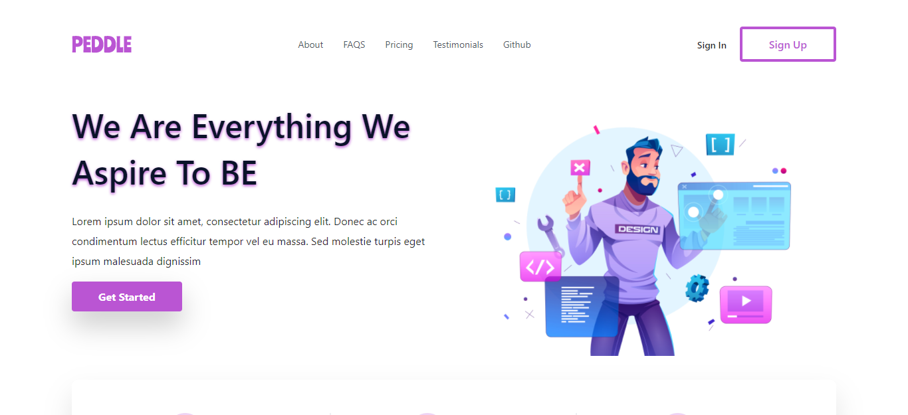
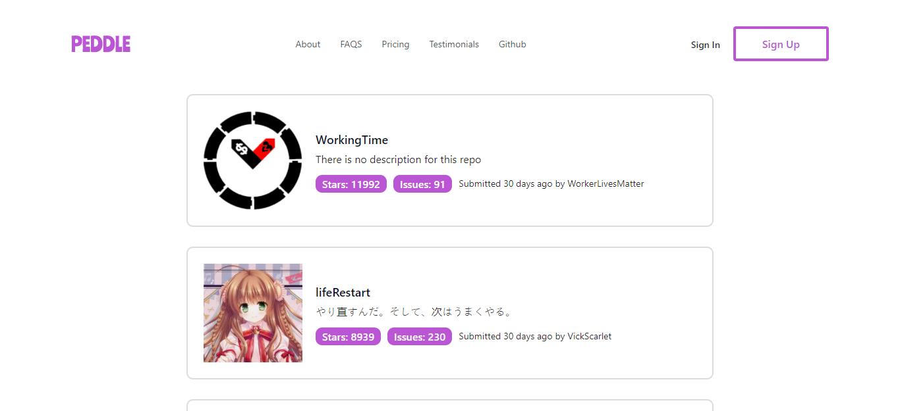

# Peddle Frontend Assessment

This is the solution of Peddle Frontend Assessment. The hompage is the design of the landing page being transformed from a figma design. The /github page is the most starred of List the most starred Github repos that were created in the last 30 days gotten from Github API.

### Bellow are the features of the app and coding best practices used:

<ul>
<li>The App is fully responsive. It can adapt to different viewport</li>
<li>Modern design concept was used to make the app catchy in eyes</li>
<li>/github route for fetching the most starred repo in the last 30 days</li>
<li>BEM — Block Element Modifier methodology was used in styling the app</li>
<li>Build reusable components</li>
<li>React hooks was used used in order to keep all components as a functional component</li>
<li>DRY - Don't Repeat Yourself principle was used</li>
</ul>
 

App was deployed on netlify after development

Below is the live demo of the app

### <a href="https://bus-seat-reservation-app.netlify.app/">Live Demo</a>

 

### Stacks and Technologies used in Developing the App

&nbsp;
&nbsp;
&nbsp;
&nbsp;
&nbsp;
&nbsp;
&nbsp;
&nbsp;
&nbsp;

 

## Available Scripts

After cloning this ropository, open your terminal and navigate to the project direcory /paddle-frontend-assessment in your terminal and run the following scripts:
 

### `yarn install`

This will install all the required modules/dependencies for your app

### `yarn start`

Runs the app in the development mode.\
Open [http://localhost:3000](http://localhost:3000) to view it in the browser.

The page will reload if you make edits.\
You will also see any lint errors in the console.

### `yarn test`

Launches the test runner in the interactive watch mode.\
See the section about [running tests](https://facebook.github.io/create-react-app/docs/running-tests) for more information.

### `yarn run build`

Builds the app for production to the `build` folder.\
It correctly bundles React in production mode and optimizes the build for the best performance.

The build is minified and the filenames include the hashes.\
Your app is ready to be deployed!
